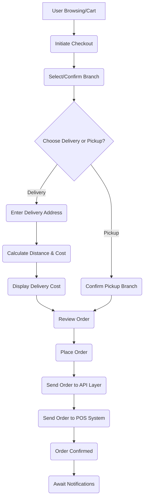

Okay, here is a system flow documentation for your PWA e-commerce project integrated with your POS system, formatted in Markdown as requested.

```markdown
# PWA E-commerce System Flow Document
Version: 1.0
Date: May 22, 2025

This document outlines the planned system architecture, user journeys, data flows, error handling, and security considerations for the PWA e-commerce platform integrated with the existing POS system.

## 2. System Overview

This system provides an online channel for customers to browse products, place orders for delivery or pickup, and receive notifications, fully integrated with the backend POS system as the source of truth for products, clients, and order processing.

**Key Components:**

*   **Progressive Web App (PWA):** The user interface accessible via web browsers and installable on mobile/desktop devices. Handles product display, search, cart management, checkout process (including location/branch selection, delivery/pickup option, address input, and cost calculation), user account management (if applicable), and order status display.
*   **API Integration Layer:** An intermediary service or set of endpoints responsible for communication between the PWA and the POS System. This layer translates requests/responses, handles authentication with the POS, and potentially performs some business logic (like delivery cost calculation based on data from the PWA and branch locations).
*   **POS System:** The existing Point of Sale system. It serves as the master data source for:
    *   Products (inventory, pricing, descriptions, images - fetched by API).
    *   Clients (fetched/updated by API, potentially linked to user accounts in PWA).
    *   Orders (received from API for processing and fulfillment).
    It also provides branch location data or an API to retrieve it.
*   **Branch Location Data:** Information about the 6 Kyiv branches (address, coordinates, potentially operating hours). This data is consumed by the API Integration Layer and/or PWA.
*   **Geolocation Service:** Used by the PWA (via browser/device capabilities) to determine the user's current location for finding nearby branches and calculating delivery distance.
*   **Notification Service:** A service (e.g., push notifications, SMS, email) integrated with the API Layer or triggered by the POS system to send order status updates to the client.

**Core Interactions:**

1.  PWA requests product and branch data from the API Integration Layer.
2.  API Integration Layer retrieves data from the POS System API.
3.  User browses products and builds a cart in the PWA.
4.  User proceeds to checkout, selects a branch (potentially aided by geolocation), chooses delivery or pickup, provides necessary details (address for delivery).
5.  PWA or API Integration Layer calculates delivery cost based on user location, selected branch location, and delivery rules.
6.  PWA sends the final order details (including calculated cost, selected branch, delivery/pickup type) to the API Integration Layer.
7.  API Integration Layer sends the order to the POS System API for processing.
8.  POS System processes the order.
9.  POS System or API Integration Layer triggers notifications via the Notification Service based on order status changes (e.g., order confirmed, ready for pickup, out for delivery, delivered).

## 3. User Workflows

Here are primary user journeys through the system.

**3.1. Browse Products & Place Order (Delivery)**

1.  **Access PWA:** User opens the PWA in a browser or installed on a device.
2.  **Browse Products:** User views product categories, searches, and browses product details (fetched from POS via API).
3.  **Add to Cart:** User adds desired products to their shopping cart.
4.  **Initiate Checkout:** User proceeds from the cart to the checkout process.
5.  **Select/Confirm Location/Branch:**
    *   PWA optionally requests user location.
    *   PWA displays nearby branches based on user location and branch data (from POS via API).
    *   User selects a preferred branch (this branch will fulfill the order).
6.  **Choose Fulfillment:** User selects "Delivery".
7.  **Enter Delivery Address:** User enters their delivery address.
8.  **Calculate Delivery Cost:**
    *   PWA uses user location/entered address and selected branch location.
    *   Calculates distance.
    *   Applies delivery rules:
        *   <= 2 km from branch: 99 UAH
        *   > 3 km from branch: 99 UAH + (distance in km - 3) * 30 UAH
        *   (Implicit assumption: 2-3km distance handling needs clarification, assuming it defaults to the >3km rule or has a specific rule like 99 UAH up to 3km). Let's assume for calculation purposes: <=2km = 99; >2km and <=3km = 99; >3km = 99 + (distance - 3) * 30. *Note: This should be confirmed.*
    *   Displays the calculated delivery cost.
9.  **Review Order:** User reviews all order details (items, quantities, prices, selected branch, delivery address, delivery cost, total).
10. **Place Order:** User confirms and places the order.
11. **Order Submission:** PWA sends order details (including selected branch, delivery type, final calculated cost) to the API Integration Layer.
12. **POS Order Creation:** API Integration Layer sends the order to the POS System API.
13. **Order Confirmation:** PWA displays order confirmation message and details.
14. **Notifications:** User receives notifications triggered by order status changes from the POS/Notification Service.

**3.2. Browse Products & Place Order (Pickup)**

Steps 1-5 are the same as the Delivery workflow.

6.  **Choose Fulfillment:** User selects "Pickup".
7.  **Confirm Pickup Branch:** The previously selected branch is confirmed as the pickup location. Delivery cost is explicitly shown as "Free".
8.  **Review Order:** User reviews all order details (items, quantities, prices, selected branch, pickup type, delivery cost [Free], total).
9.  **Place Order:** User confirms and places the order.
10. **Order Submission:** PWA sends order details (including selected branch, pickup type, delivery cost [0]) to the API Integration Layer.
11. **POS Order Creation:** API Integration Layer sends the order to the POS System API.
12. **Order Confirmation:** PWA displays order confirmation message and details.
13. **Notifications:** User receives notifications triggered by order status changes from the POS/Notification Service (e.g., "Your order is ready for pickup").

**Mermaid Diagram: Order Placement Workflow**



## 4. Data Flows

This section describes the movement of key data throughout the system.

**4.1. Product & Branch Data Sync**

*   **Flow:** POS System -> API Integration Layer -> PWA
*   **Description:** The PWA needs to display the latest product catalog and branch information. The API Integration Layer periodically fetches this data from the POS System API (either full sync or incremental updates) and serves it to the PWA. The PWA might cache this data. Ability to change product details is mentioned - this likely means updating *in the PWA's view* (e.g., adding marketing text) or suggesting changes back to POS via API if the POS allows such updates. Assuming initial scope is fetching *from* POS.
*   **Data Content:** Product details (Name, Description, Price, Images, Category, Inventory Status - if available via API), Branch details (Name, Address, Coordinates, Contact Info, potentially operating hours).

**4.2. Client Data Sync (Optional/Conditional)**

*   **Flow:** PWA <-> API Integration Layer <-> POS System
*   **Description:** If the PWA supports user accounts linked to POS client data, the PWA might retrieve client information (e.g., name, contact details, potentially order history) from the POS via the API Layer for logged-in users. New clients registered via PWA would be sent to the POS via the API Layer.
*   **Data Content:** Client details (Name, Phone, Email, Address).

**4.3. Order Submission**

*   **Flow:** PWA -> API Integration Layer -> POS System
*   **Description:** When a user places an order, the PWA sends the complete order details to the API Integration Layer. The API Layer formats this data according to the POS API specifications and sends it to the POS System for creation and processing.
*   **Data Content:** Ordered items (Product ID, Quantity, Price), Selected Branch ID, Fulfillment Type (Delivery/Pickup), Delivery Address (if applicable), Calculated Delivery Cost, Client Details (linked ID or partial info), Timestamp.

**4.4. Order Status & Notifications**

*   **Flow:** POS System -> (Trigger) API Integration Layer -> Notification Service -> Client Device
*   **Description:** As the order progresses through states in the POS (e.g., New, Processing, Ready for Pickup, Out for Delivery, Completed, Cancelled), the POS System needs to trigger an update. This trigger could be a webhook call *from* the POS *to* the API Integration Layer, or the API Integration Layer could periodically poll the POS for status updates on active orders. The API Integration Layer then communicates with the Notification Service to send a message to the client associated with the order.
*   **Data Content:** Order ID, Current Status, relevant details (e.g., "ready for pickup at [branch name]", "out for delivery to [address]").

**Mermaid Diagram: Core Data Flow**

```mermaid
graph LR
    User[Client Device] --> PWA{{PWA}};
    PWA --> API_Layer(API Integration Layer);
    API_Layer --> POS_System[(POS System)];
    POS_System --> API_Layer;
    API_Layer --> PWA;
    API_Layer --> Notification_Service(Notification Service);
    POS_System --> Notification_Service; %% Alternative trigger source
    Notification_Service -- Notifications --> User;
    PWA -- Geolocation --> Browser_API(Browser/Device Geolocation API);
    API_Layer -- Branch Data --> PWA; %% Specific data flow emphasis
```

## 5. Error Handling

Robust error handling is necessary to provide a reliable user experience and aid in debugging.

**Key Error Scenarios:**

*   **API Communication Failures:**
    *   API Integration Layer unable to connect to POS System API (network issues, POS down).
    *   POS System API returns errors (e.g., invalid request, internal server error).
    *   API Integration Layer internal errors.
*   **Data Issues:**
    *   POS API returns malformed or unexpected data.
    *   Missing required data (e.g., product price missing).
    *   Validation errors (e.g., submitting an order with negative quantity).
*   **Business Logic Failures:**
    *   POS rejects order due to internal rules (e.g., inventory discrepancy, client issue).
    *   Geolocation service fails or user denies permission, preventing distance calculation.
*   **PWA Client-side Errors:**
    *   Network connectivity issues on the user's device.
    *   Client-side validation errors.

**Handling Strategies:**

*   **User Feedback:**
    *   Display clear, non-technical error messages to the user (e.g., "Could not load products, please try again," "Error placing your order, please contact support," "Unable to get your location for delivery calculation").
    *   Inform users about potential issues during checkout (e.g., if a product becomes unavailable between adding to cart and checkout).
*   **API Integration Layer:**
    *   Implement robust logging of all requests and responses to/from the POS API.
    *   Implement retry logic with exponential backoff for transient POS API errors.
    *   Gracefully handle POS API downtime (e.g., return cached data if acceptable, display service unavailable message).
    *   Perform server-side validation of incoming order data from the PWA before sending to POS.
*   **PWA:**
    *   Implement client-side validation to catch common errors early.
    *   Provide fallback mechanisms (e.g., manual address input if geolocation fails).
    *   Implement error boundaries to prevent application crashes due to component errors.
    *   Handle network status changes gracefully (e.g., show offline message).
*   **Monitoring and Alerting:**
    *   Implement monitoring on the API Integration Layer and POS System connection to proactively detect failures.
    *   Set up alerts for critical errors (e.g., inability to sync products, consistent order submission failures).

## 6. Security Flows

Securing the PWA and the integration with the POS system is paramount to protect both customer and business data.

**Key Security Measures:**

*   **API Authentication & Authorization:**
    *   **PWA to API Layer:** Implement authentication for the PWA to interact with the API Integration Layer. This could be simple API key usage for read-only public data (products) and token-based authentication (e.g., JWT after user login) for actions involving user/client data or order placement.
    *   **API Layer to POS System:** The API Integration Layer must securely authenticate with the POS System API using credentials provided by the POS vendor (e.g., API keys, OAuth tokens). These credentials must be stored securely on the server hosting the API Integration Layer (not in the PWA).
    *   **Authorization:** The API Integration Layer must enforce authorization rules, ensuring that requests are permitted based on the authenticated user/client (e.g., a user can only view *their* own orders).
*   **Data Encryption:**
    *   All communication between the PWA, API Integration Layer, and POS System must be secured using HTTPS (TLS/SSL) to ensure data is encrypted in transit.
    *   Sensitive data stored at rest (e.g., API credentials) must be encrypted.
*   **Input Validation and Sanitization:**
    *   Strict validation and sanitization of all data received from the PWA (user input, order details) must be performed on the server-side (API Integration Layer) before processing or forwarding to the POS. This prevents common web vulnerabilities like SQL injection or Cross-Site Scripting (XSS).
*   **Secure Credential Management:**
    *   API keys and other secrets used by the API Integration Layer to communicate with the POS must be stored securely (e.g., using environment variables, dedicated secrets management systems) and never hardcoded in the application code.
*   **User Authentication (Optional but Recommended for Client Features):**
    *   If the system involves client accounts from the POS, implement secure user registration and login flows within the PWA. This includes securely handling passwords (hashing and salting), managing user sessions (e.g., using secure tokens), and implementing measures like account lockout policies.
*   **Protecting against Common Web Vulnerabilities:**
    *   Implement standard security practices in the PWA and API Layer to protect against vulnerabilities such as CSRF, XSS (client-side measures complementing server-side sanitization), clickjacking, etc.
*   **Rate Limiting:**
    *   Apply rate limiting to API endpoints to mitigate the impact of abusive requests or denial-of-service attempts.

This document provides a foundational overview of the system flows. Further detailed design will be needed for specific API specifications, data models, and implementation details within each component.
```
