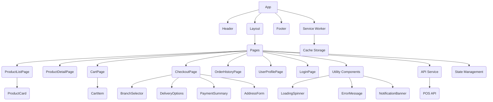

```markdown
# PWA E-commerce Frontend Implementation Guide

**Version:** 1.0
**Date:** May 22, 2025

This document provides a frontend implementation guide for building a Progressive Web App (PWA) e-commerce website integrated with a POS system API.

## 1. Component Architecture

The application should follow a modular component architecture, structuring the UI into reusable and focused pieces. A potential structure could look like this:

*   **Core Layout:**
    *   `App`: The main application entry point, handling routing and overall structure.
    *   `Header`: Contains navigation, search bar, cart icon, user login/profile link.
    *   `Footer`: Contains links, contact info, etc.
    *   `Layout`: A wrapper component providing consistent padding/margins.
*   **Pages (Containers):** Components representing full views or pages.
    *   `HomePage`: Displays featured products, categories, possibly branches.
    *   `ProductListPage`: Displays a list of products, potentially with filters/sorting.
    *   `ProductDetailPage`: Displays detailed information for a single product.
    *   `CartPage`: Displays current items in the cart and allows quantity adjustments.
    *   `CheckoutPage`: Guides the user through the order process (shipping/pickup, branch selection, payment summary).
    *   `OrderHistoryPage`: Displays past orders for the logged-in user.
    *   `UserProfilePage`: Displays user details.
    *   `LoginPage`, `RegisterPage`.
*   **Shared/Presentational Components:** Reusable UI elements.
    *   `ProductCard`: Displays a single product item in a list.
    *   `CartItem`: Displays a single item in the cart.
    *   `BranchSelector`: Component to choose a branch, potentially integrating location services or a map.
    *   `DeliveryOptions`: Component to select delivery or pickup, calculate delivery cost.
    *   `NotificationBanner/Toast`: Displays system notifications (e.g., "Item added to cart", "Order placed", "Order status updated").
    *   `LoadingSpinner`, `ErrorMessage`.
    *   `Button`, `Input`, `Modal`.
*   **Service Workers (PWA specific):** Handles offline caching of assets (HTML, CSS, JS, images) and potentially some API responses for improved performance and offline capability. Note: Full offline ordering won't be possible due to POS dependency, but a better user experience during flaky connectivity is achievable.

**Component Relationships:**

*   `App` contains `Layout`, `Header`, `Footer`, and handles routing to different `Pages`.
*   `Pages` fetch data and orchestrate interactions between `Shared Components`.
*   `Shared Components` receive data via props and emit events for user interactions.
*   `API Service` is consumed by `Pages` or dedicated data-fetching hooks/modules.
*   `State Management` is accessed by `Pages` and potentially `Shared Components` (e.g., Cart state).



## 2. State Management

Effective state management is crucial for handling data like the product catalog, the user's cart, authentication status, selected branch, and order details across different components.

**Key State Areas:**

*   **Authentication State:** User login status, user data, authentication token.
*   **Product State:** List of products, product details, loading/error states for product fetching.
*   **Cart State:** List of items in the cart (product ID, quantity), total price, number of items.
*   **Branch State:** List of available branches, selected branch, user's detected/input location.
*   **Order State:** Order details during checkout, placing order status, order history.
*   **UI State:** Loading indicators, error messages, notification messages, modal visibility.

**Suggested Approaches:**

*   **Context API (React) / Pinia (Vue) / Svelte Stores (Svelte):** Suitable for many e-commerce applications. Allows creating dedicated stores or contexts for different parts of the state (e.g., `AuthContext`, `CartContext`, `ProductContext`). This keeps related state together and provides a clear way for components to access and update it.
*   **Redux / Zustand / MobX (More complex apps):** Consider a dedicated state management library if the application grows significantly in complexity, with many interconnected state changes and asynchronous operations. Zustand is often a good balance of simplicity and power.

**Example (Conceptual using React/Context API):**

```javascript
// src/context/CartContext.js
import React, { createContext, useContext, useState } from 'react';

const CartContext = createContext();

export const CartProvider = ({ children }) => {
  const [cartItems, setCartItems] = useState([]);

  const addItemToCart = (product, quantity = 1) => {
    setCartItems(prevItems => {
      const existingItemIndex = prevItems.findIndex(item => item.id === product.id);
      if (existingItemIndex > -1) {
        // Update quantity if item exists
        const newItems = [...prevItems];
        newItems[existingItemIndex].quantity += quantity;
        return newItems;
      } else {
        // Add new item
        return [...prevItems, { ...product, quantity }];
      }
    });
  };

  const removeItemFromCart = (productId) => {
    setCartItems(prevItems => prevItems.filter(item => item.id !== productId));
  };

  const updateItemQuantity = (productId, quantity) => {
     setCartItems(prevItems => {
        const newItems = [...prevItems];
        const itemIndex = newItems.findIndex(item => item.id === productId);
        if (itemIndex > -1) {
            if (quantity <= 0) {
                newItems.splice(itemIndex, 1); // Remove if quantity is zero or less
            } else {
                newItems[itemIndex].quantity = quantity;
            }
        }
        return newItems;
     });
  };

  const clearCart = () => {
    setCartItems([]);
  };

  // Calculate total price (example, assuming product has 'price' field)
  const cartTotal = cartItems.reduce((sum, item) => sum + item.price * item.quantity, 0);

  return (
    <CartContext.Provider value={{
      cartItems,
      addItemToCart,
      removeItemFromCart,
      updateItemQuantity,
      clearCart,
      cartTotal,
    }}>
      {children}
    </CartContext.Provider>
  );
};

export const useCart = () => useContext(CartContext);

// In your App component tree:
// <CartProvider>
//   <App />
// </CartProvider>

// In a component (e.g., ProductCard):
// import { useCart } from '../context/CartContext';
// const { addItemToCart } = useCart();
// <button onClick={() => addItemToCart(product)}>Add to Cart</button>

// In CartPage:
// import { useCart } from '../context/CartContext';
// const { cartItems, updateItemQuantity, removeItemFromCart, cartTotal } = useCart();
// ... render cartItems ...
// <div>Total: {cartTotal} UAH</div>
```

## 3. UI Design

The design should prioritize a mobile-first, user-friendly, and performant experience, aligning with PWA principles.

**Key Design Considerations:**

*   **Mobile-First & Responsive:** Design and implement for small screens first, scaling up to larger devices. Use flexible layouts (Flexbox, Grid).
*   **Performance:** Optimize images, use lazy loading, minimize render-blocking resources. Service workers help with caching assets.
*   **Clear Navigation:** Intuitive access to product categories, search, cart, and user account. Sticky headers can improve navigation on scroll.
*   **Product Listing:** Display clear product images, names, and prices. Options for filtering and sorting if the catalog is large. Infinite scroll or pagination for long lists.
*   **Product Details:** High-quality images (with zoom/gallery), detailed description, price, clear "Add to Cart" button with quantity selector.
*   **Cart Experience:** Easy review of items, ability to change quantity, remove items, clear display of subtotal. Prominent "Proceed to Checkout" button.
*   **Checkout Flow:**
    *   **Multi-step Process:** Break down checkout into logical steps (e.g., Cart -> Details -> Review & Place Order).
    *   **Location/Branch Selection:**
        *   Prompt for user location (with permission).
        *   Display nearby branches based on location.
        *   Allow manual selection of a branch from a list or map.
    *   **Delivery/Pickup Option:** Clear radio buttons or toggles for "Delivery" or "Pickup".
    *   **Delivery Address Input:** If delivery is selected. Use autocomplete for addresses if possible.
    *   **Delivery Cost Calculation:** Dynamically display the calculated delivery cost based on branch, delivery type, and delivery address distance.
    *   **Order Summary:** Clear breakdown of items, subtotal, delivery cost, and total.
    *   **Payment Method:** Integration points for payment gateways (usually separate from POS API for payment *processing*, but confirmation sent to POS).
*   **Notifications:** Non-intrusive banners or toast messages for important updates (item added, order status changes). Requires a mechanism to receive updates (e.g., WebSockets, polling the order status API endpoint, or push notifications if implemented).
*   **User Account:** Order history, profile details.
*   **Offline Indicators:** Provide feedback when the app is offline (e.g., a small banner). While placing orders requires connectivity, browsing cached content should ideally still work.
*   **Installability:** Guide users to install the PWA on their home screen.

## 4. API Integration

Integration with the POS API is central. This involves fetching data, handling authentication, and sending transactional information.

**Core API Interactions:**

*   **Authentication:**
    *   Login/Register client (requires `POST /clients/login`, `POST /clients/register` or similar).
    *   Store authentication token securely (e.g., HttpOnly cookies, localStorage/sessionStorage depending on security considerations). Include token in subsequent API requests.
*   **Fetching Data:**
    *   Get Products: `GET /products` (list), `GET /products/:id` (detail). Implement filtering/sorting if needed.
    *   Get Branches: `GET /branches`. This should return branch details including location (coordinates).
    *   Get Client Data: `GET /clients/:id` or `/profile` (for logged-in user).
    *   Get Order Status/History: `GET /orders/:id`, `GET /clients/:id/orders`.
*   **Sending Data:**
    *   Place Order: `POST /orders`. This is the most critical endpoint. The payload must include:
        *   Client identifier (if logged in).
        *   Selected Branch ID.
        *   Order type (`delivery` or `pickup`).
        *   Cart items (product IDs and quantities).
        *   Delivery Address (if type is `delivery`).
        *   Calculated Delivery Cost (send this along, though the POS might recalculate).
        *   Payment status/details (depends on POS API structure).
*   **Notification Data:** Need an endpoint to poll for order status updates (`GET /orders/:id`) or implement a more real-time solution like WebSockets if the POS API supports it.

**Implementation Strategy:**

*   Use a library like `fetch` or `axios` for HTTP requests.
*   Create dedicated API service modules (e.g., `api/products.js`, `api/auth.js`, `api/orders.js`) to centralize API calls and keep components clean.
*   Handle loading, success, and error states for every API call. Display loading spinners and error messages to the user.
*   Implement request interceptors (with `axios`) or middleware (with `fetch`) to automatically attach authentication tokens to outgoing requests.
*   Implement response interceptors to handle authentication errors (e.g., token expired) and redirect the user to the login page.
*   Map incoming API data structures to your frontend data models to ensure consistency.

**Example (Using `fetch` and a service pattern):**

```javascript
// src/api/apiService.js
const API_BASE_URL = 'YOUR_POS_API_URL'; // Replace with your actual API base URL

// Helper to get auth token (replace with your actual token storage logic)
const getAuthToken = () => localStorage.getItem('authToken');

// Generic request function
const request = async (endpoint, method = 'GET', data = null) => {
  const url = `${API_BASE_URL}${endpoint}`;
  const headers = {
    'Content-Type': 'application/json',
    // Add auth header if token exists
    ...(getAuthToken() && { 'Authorization': `Bearer ${getAuthToken()}` }),
  };

  const config = {
    method,
    headers,
    body: data ? JSON.stringify(data) : null,
  };

  try {
    const response = await fetch(url, config);

    if (!response.ok) {
      // Handle specific errors, e.g., unauthorized (401)
      if (response.status === 401) {
        // Redirect to login or refresh token
        console.error('Authentication failed');
        // Example: window.location.href = '/login';
      }
      const errorData = await response.json();
      throw new Error(errorData.message || `API error: ${response.status}`);
    }

    // Handle cases where response might not have JSON body (e.g., 204 No Content)
    const text = await response.text();
    return text ? JSON.parse(text) : null;

  } catch (error) {
    console.error('API Request Error:', error);
    throw error; // Re-throw to be handled by calling component/hook
  }
};

// src/api/productService.js
import { request } from './apiService';

export const getProducts = async () => request('/products');
export const getProductById = async (id) => request(`/products/${id}`);

// src/api/branchService.js
import { request } from './apiService';

export const getBranches = async () => request('/branches');

// src/api/orderService.js
import { request } from './apiService';

export const placeOrder = async (orderDetails) => request('/orders', 'POST', orderDetails);
export const getOrderStatus = async (orderId) => request(`/orders/${orderId}`);

// Example usage in a React component/hook:
// import { getProducts } from '../api/productService';
// import { useState, useEffect } from 'react';
//
// function useProducts() {
//   const [products, setProducts] = useState([]);
//   const [loading, setLoading] = useState(true);
//   const [error, setError] = useState(null);
//
//   useEffect(() => {
//     const fetchProducts = async () => {
//       try {
//         setLoading(true);
//         const data = await getProducts();
//         setProducts(data);
//       } catch (err) {
//         setError(err);
//       } finally {
//         setLoading(false);
//       }
//     };
//     fetchProducts();
//   }, []); // Empty dependency array means run once on mount
//
//   return { products, loading, error };
// }
```

## 5. Testing Approach

A robust testing strategy is essential to ensure the application is reliable, especially given the critical integration with the POS system.

**Types of Tests:**

*   **Unit Tests:** Test individual functions, components (in isolation), and utility classes.
    *   *Examples:* Delivery price calculation logic, Cart context/reducer functions, API service helper functions, form validation logic.
    *   *Tools:* Jest, Vitest.
*   **Component Tests:** Test components with mocked props and state to ensure they render correctly and respond to user interactions as expected.
    *   *Examples:* `ProductCard` renders correct price/image, `CartItem` updates quantity on button click, `BranchSelector` displays branches fetched via a mock API.
    *   *Tools:* React Testing Library, Vue Test Utils, Jest/Vitest with JSDOM.
*   **Integration Tests:** Test the interaction between multiple components or between components and services (e.g., state management, API service).
    *   *Examples:* Adding an item from `ProductDetailPage` updates the `CartContext` and the cart icon in the `Header`. Clicking "Place Order" in `CheckoutPage` calls the `orderService.placeOrder` API function with the correct payload.
    *   *Tools:* React Testing Library, Vue Test Utils, Jest/Vitest.
*   **End-to-End (E2E) Tests:** Test the entire user flow from start to finish by simulating user actions in a real browser environment.
    *   *Examples:* A user navigates to the homepage, adds a product to the cart, proceeds to checkout, selects pickup/delivery, fills in details, and clicks "Place Order".
    *   *Tools:* Cypress, Playwright.
*   **PWA Specific Tests:**
    *   Test Service Worker registration and caching strategy.
    *   Test basic offline behavior (browsing cached pages/products).
    *   Test installability prompt.
*   **Manual Testing:** Crucial for usability, cross-browser compatibility, and PWA features (installability, offline).

**Testing Strategy:**

1.  **Prioritize Critical Paths:** Focus testing efforts on core user flows: browsing products, adding to cart, checkout, and placing an order.
2.  **Mock API Responses:** For component and integration tests, mock API calls to control data and simulate different scenarios (success, loading, error).
3.  **Test Edge Cases:** Include tests for scenarios like empty cart, invalid delivery address, unavailable products, API errors, network issues during checkout.
4.  **Automate Where Possible:** Use unit, component, and integration tests in your CI/CD pipeline. E2E tests can be added for critical flows but can be more fragile.
5.  **Regular Manual Testing:** Perform manual testing on different devices and browsers, especially for PWA features and UI responsiveness.
6.  **Test Delivery Pricing Logic:** Ensure the delivery cost calculation function is thoroughly unit tested with various distances (0-2km, 2.1km, 3km, 3.1km, 10km etc.).

## 6. Code Examples

Here are code examples illustrating key functionalities.

**Example 1: Delivery Price Calculation Function**

This function implements the specific delivery pricing logic (0-2km = 99 UAH, >3km costs +30 UAH for every km *over 3km* - based on the prompt's wording. *Self-correction:* The prompt says ">3 km every km costs +30 uah". This could mean +30 for each km beyond 3km, *or* +30 for each km beyond the *initial* 2km base fee? Let's refine the interpretation: Base fee 99 UAH covers up to 2km. For distance `d`, if `d > 3`, the *additional* cost is `(d - 3) * 30`. The gap between 2km and 3km is still ambiguous. Let's assume the 99 UAH base fee applies for 0-2km. For >2km, the 99 UAH is still the base, *and* the +30/km applies for every km *beyond 2km*. So, 2.1km costs 99 + (0.1 * 30) = 102. 3.1km costs 99 + (1.1 * 30) = 99 + 33 = 132. This seems more logical for a stepped price. Let's go with this interpretation: 0-2km = 99 UAH. For >2km, the cost is 99 UAH + (distance - 2) * 30 UAH.

```javascript
// src/utils/deliveryPricing.js

/**
 * Calculates delivery cost based on distance in kilometers.
 * @param {number} distanceInKm - The distance from the branch to the delivery address in kilometers.
 * @returns {number} The calculated delivery cost in UAH.
 */
export const calculateDeliveryCost = (distanceInKm) => {
  const baseFee = 99; // UAH
  const baseDistance = 2; // km
  const pricePerExtraKm = 30; // UAH

  if (typeof distanceInKm !== 'number' || distanceInKm < 0) {
    console.error("Invalid distance provided for delivery cost calculation.");
    // Or throw an error, depending on desired behavior
    return NaN; // Or 0, or throw
  }

  // Local pickup case (distance is irrelevant, but function might be misused)
  // If distance is effectively zero (e.g., pickup), cost is 0.
  // This function is specifically for delivery, assume distance > 0 for delivery
  if (distanceInKm === 0) {
      // This case should probably be handled *before* calling this function
      // If called with 0, treat as delivery to very close point, applies base?
      // Let's assume distanceInKm > 0 for actual delivery
  }


  // As per refined interpretation: 0-2km is base fee, >2km adds per km
  if (distanceInKm <= baseDistance) {
    return baseFee;
  } else {
    const extraDistance = distanceInKm - baseDistance;
    // Calculate cost for full extra kilometers
    const extraCost = Math.ceil(extraDistance) * pricePerExtraKm; // Assuming per full km increment?
    // Let's re-read: "if more than 3 km every km costs +30 uah".
    // This is still ambiguous. Let's stick to the simplest interpretation matching the example:
    // 0-2km = 99.
    // >3km, cost is 99 + (distance - 3) * 30. What about 2-3km? Let's assume 2-3km is also 99.
    // This makes 99 UAH for 0-3km, and then +30 for every km beyond 3km.
    // Refined Interpretation 2: 0-3km = 99 UAH. >3km = 99 UAH + (distanceInKm - 3) * 30.

    const baseDistanceRevised = 3; // km, based on new interpretation

    if (distanceInKm <= baseDistanceRevised) {
        return baseFee;
    } else {
        const extraDistance = distanceInKm - baseDistanceRevised;
         // The prompt says "every km costs +30". This usually means for *each* km *increment*.
         // If distance is 3.1km, it's 99 + 30*1 = 129. If 4.1km, it's 99 + 30*2 = 159.
         // So it's (distance - 3) rounded *up* to the nearest whole number, multiplied by 30?
         // Or is it just (distance - 3) * 30 ? Let's use ceiling for full km increments over 3.
         // Example: 3.1 km -> Math.ceil(0.1) * 30 = 1 * 30 = 30. Total 99+30=129.
         // Example: 4.0 km -> Math.ceil(1.0) * 30 = 1 * 30 = 30. Total 99+30=129.
         // Example: 4.1 km -> Math.ceil(1.1) * 30 = 2 * 30 = 60. Total 99+60=159.
         // This interpretation makes sense.

        const extraCost = Math.ceil(extraDistance) * pricePerExtraKm;
        return baseFee + extraCost;
    }
};

// Example Usage:
// calculateDeliveryCost(1); // Returns 99
// calculateDeliveryCost(2); // Returns 99
// calculateDeliveryCost(2.5); // Returns 99 (assuming 0-3km is base)
// calculateDeliveryCost(3); // Returns 99
// calculateDeliveryCost(3.1); // Returns 99 + Math.ceil(0.1)*30 = 99 + 1*30 = 129
// calculateDeliveryCost(4); // Returns 99 + Math.ceil(1.0)*30 = 99 + 1*30 = 129
// calculateDeliveryCost(4.1); // Returns 99 + Math.ceil(1.1)*30 = 99 + 2*30 = 159
// calculateDeliveryCost(10); // Returns 99 + Math.ceil(7.0)*30 = 99 + 7*30 = 99 + 210 = 309

```
*Self-Correction again*: The prompt *literally* says ">3 km every km costs +30 uah". It doesn't specify what happens *between* 2km and 3km. It *also* says "Delivery to 2 km radius of branch costs 99 uah". Let's assume the 99 UAH is the *minimum* delivery cost and covers up to *and including* 2km. For *any* distance *over* 2km, the *additional* cost is calculated. If it's >3km, *every km* adds 30. This implies the cost applies to kms *after* the base?

Let's try a simpler, very common pricing model interpretation:
- 0 to 2 km: 99 UAH (fixed)
- > 2 km: 99 UAH base + (distance - 2) * 30 UAH. This calculation applies *for every km* past 2km.
- Example: 2.1 km -> 99 + (0.1 * 30) = 102 UAH
- Example: 3.0 km -> 99 + (1.0 * 30) = 129 UAH
- Example: 3.1 km -> 99 + (1.1 * 30) = 132 UAH
- Example: 4.0 km -> 99 + (2.0 * 30) = 159 UAH
- Example: 4.1 km -> 99 + (2.1 * 30) = 162 UAH

This interpretation seems the most standard way to apply a per-km fee after a base distance. Let's use this.

```javascript
// src/utils/deliveryPricing.js

/**
 * Calculates delivery cost based on distance in kilometers.
 * @param {number} distanceInKm - The distance from the branch to the delivery address in kilometers.
 * @returns {number} The calculated delivery cost in UAH. Returns NaN if distance is invalid.
 */
export const calculateDeliveryCost = (distanceInKm) => {
  const baseFee = 99; // UAH
  const baseDistanceIncluded = 2; // km covered by the base fee
  const pricePerExtraKm = 30; // UAH for every km OVER the baseDistanceIncluded

  if (typeof distanceInKm !== 'number' || distanceInKm < 0) {
    console.error("Invalid distance provided for delivery cost calculation.");
    return NaN;
  }

  // Local pickup cost is 0, this function is for delivery distance > 0
  if (distanceInKm === 0) {
     // This might indicate an error in logic if called for delivery,
     // or perhaps a test case. Let's return the base fee as minimum delivery cost.
     // Or, perhaps 0 indicates it's actually pickup? Let's assume distance > 0 for delivery.
     // If distance is truly 0 for delivery, base fee likely applies.
     return baseFee;
  }


  if (distanceInKm <= baseDistanceIncluded) {
    return baseFee;
  } else {
    const extraDistance = distanceInKm - baseDistanceIncluded;
    // Cost is base fee + (extra distance * price per extra km)
    // Use Math.ceil if rounding up to the nearest full km increment over the base distance.
    // Use simple multiplication if cost scales linearly with distance over the base.
    // "every km costs +30" usually implies the latter (linear).
    const extraCost = extraDistance * pricePerExtraKm;
    return baseFee + extraCost;
  }
};

// Example Usage (using the second interpretation):
// calculateDeliveryCost(1); // Returns 99
// calculateDeliveryCost(2); // Returns 99
// calculateDeliveryCost(2.1); // Returns 99 + (0.1 * 30) = 102
// calculateDeliveryCost(3); // Returns 99 + (1.0 * 30) = 129
// calculateDeliveryCost(3.1); // Returns 99 + (1.1 * 30) = 132
// calculateDeliveryCost(4); // Returns 99 + (2.0 * 30) = 159
// calculateDeliveryCost(10); // Returns 99 + (8.0 * 30) = 99 + 240 = 339
```
This second interpretation seems more consistent with standard per-km pricing. This function would be used in the `CheckoutPage` or `DeliveryOptions` component after the user selects delivery and provides an address. You'll need a way to calculate the distance between the selected branch and the delivery address (requires geolocation/mapping services, outside the direct scope of this guide but a necessary step).

**Example 2: Simplified Product Card Component (React)**

```javascript
// src/components/ProductCard.js
import React from 'react';
import './ProductCard.css'; // Assume you have some CSS

const ProductCard = ({ product, onAddToCart }) => {
  if (!product) return null;

  return (
    <div className="product-card">
      
      <div className="product-card-info">
        <h3 className="product-card-name">{product.name}</h3>
        <p className="product-card-price">{product.price} UAH</p>
        {/* Link to detail page - using a placeholder link */}
        <a href={`/products/${product.id}`} className="product-card-details-link">Details</a>
        <button
          className="product-card-add-button"
          onClick={() => onAddToCart(product)}
          aria-label={`Add ${product.name} to cart`}
        >
          Add to Cart
        </button>
      </div>
    </div>
  );
};

export default ProductCard;

// Example Usage in ProductListPage:
// import ProductCard from '../components/ProductCard';
// import { useProducts } from '../hooks/useProducts'; // Assuming a custom hook for fetching
// import { useCart } from '../context/CartContext'; // Assuming cart context

// function ProductListPage() {
//   const { products, loading, error } = useProducts(); // Fetch products
//   const { addItemToCart } = useCart(); // Get add to cart function from context

//   if (loading) return <p>Loading products...</p>;
//   if (error) return <p>Error loading products: {error.message}</p>;

//   return (
//     <div className="product-list">
//       {products.map(product => (
//         <ProductCard
//           key={product.id}
//           product={product}
//           onAddToCart={addItemToCart} // Pass the cart function down
//         />
//       ))}
//     </div>
//   );
// }
```

**Example 3: Placing an Order (React Component Logic Snippet)**

This example shows the logic within a checkout component to gather data and send the order. It assumes state variables hold selected options and address.

```javascript
// src/pages/CheckoutPage.js
import React, { useState, useEffect } from 'react';
import { useCart } from '../context/CartContext';
import { useAuth } from '../context/AuthContext'; // Assuming auth context
import { useBranches } from '../hooks/useBranches'; // Assuming hook to fetch branches
import { placeOrder } from '../api/orderService';
import { calculateDeliveryCost } from '../utils/deliveryPricing'; // Our utility function
import BranchSelector from '../components/BranchSelector';
import DeliveryOptions from '../components/DeliveryOptions';
import AddressForm from '../components/AddressForm'; // Component to handle address input
import NotificationBanner from '../components/NotificationBanner'; // Component for notifications

function CheckoutPage() {
  const { cartItems, cartTotal, clearCart } = useCart();
  const { user } = useAuth(); // Get logged-in user info
  const { branches, loadingBranches, errorBranches } = useBranches(); // Fetch branches
  const [selectedBranch, setSelectedBranch] = useState(null);
  const [orderType, setOrderType] = useState('pickup'); // 'pickup' or 'delivery'
  const [deliveryAddress, setDeliveryAddress] = useState(null); // { street, city, postcode, ... }
  const [deliveryDistance, setDeliveryDistance] = useState(0); // Distance in km
  const [deliveryCost, setDeliveryCost] = useState(0);
  const [isPlacingOrder, setIsPlacingOrder] = useState(false);
  const [orderError, setOrderError] = useState(null);
  const [orderSuccess, setOrderSuccess] = useState(false);

  // Effect to calculate delivery cost when branch, type, or address/distance changes
  useEffect(() => {
    if (orderType === 'delivery' && selectedBranch && deliveryAddress && deliveryDistance > 0) {
        const cost = calculateDeliveryCost(deliveryDistance);
        setDeliveryCost(cost);
    } else {
        setDeliveryCost(0); // No delivery cost for pickup or incomplete delivery info
    }
     // This is where you'd integrate geodesic distance calculation based on selectedBranch.location and deliveryAddress.coordinates
     // For this example, let's assume deliveryDistance is somehow determined and set
     // E.g., via a mapping service API call after address input.
  }, [orderType, selectedBranch, deliveryAddress, deliveryDistance]);


  const handlePlaceOrder = async () => {
    if (cartItems.length === 0) {
      alert('Your cart is empty.'); // Or show notification
      return;
    }
    if (!selectedBranch) {
        alert('Please select a branch.');
        return;
    }
    if (orderType === 'delivery' && !deliveryAddress) {
         alert('Please enter delivery address.');
         return;
    }

    setIsPlacingOrder(true);
    setOrderError(null);
    setOrderSuccess(false);

    // Construct the order payload for the POS API
    const orderPayload = {
      clientId: user ? user.id : null, // Send client ID if logged in
      branchId: selectedBranch.id,
      type: orderType, // 'delivery' or 'pickup'
      items: cartItems.map(item => ({
        productId: item.id,
        quantity: item.quantity,
        // Include price per item if POS API requires it for verification
        price: item.price
      })),
      totalAmount: cartTotal + deliveryCost, // Total including delivery
      deliveryDetails: orderType === 'delivery' ? {
        address: deliveryAddress,
        distanceInKm: deliveryDistance, // Optional, might be useful for POS logging
        deliveryCost: deliveryCost,
        // Add contact info from user/address form
      } : null,
      pickupDetails: orderType === 'pickup' ? {
        branchId: selectedBranch.id, // Redundant but explicit
      } : null,
      // Add payment method details here if applicable before sending to POS
      // paymentMethod: 'card_on_delivery' or 'paid_online' etc.
    };

    try {
      const result = await placeOrder(orderPayload);
      console.log('Order placed successfully:', result);
      // Show success notification
      setOrderSuccess(true);
      // Clear the cart after successful order
      clearCart();
      // Redirect to order history or success page
      // history.push(`/order/${result.orderId}`); // Assuming API returns orderId
    } catch (error) {
      console.error('Error placing order:', error);
      setOrderError(error.message || 'Failed to place order. Please try again.');
      // Show error notification
    } finally {
      setIsPlacingOrder(false);
    }
  };

  // --- Render logic for the checkout page ---
  return (
    <div className="checkout-page">
      <h2>Checkout</h2>

      {orderSuccess && <NotificationBanner message="Order placed successfully!" type="success" />}
      {orderError && <NotificationBanner message={`Error: ${orderError}`} type="error" />}

      {cartItems.length === 0 && !orderSuccess ? (
          <p>Your cart is empty. Add items to proceed.</p>
      ) : (
          <>
            {/* Cart Summary Component */}
            <div className="order-summary">
              <h3>Order Summary</h3>
              {cartItems.map(item => (
                <div key={item.id}>{item.name} x{item.quantity} - {item.price * item.quantity} UAH</div>
              ))}
              <div>Subtotal: {cartTotal} UAH</div>
            </div>

            {/* Branch Selection */}
            <BranchSelector
                branches={branches}
                loading={loadingBranches}
                error={errorBranches}
                onSelectBranch={setSelectedBranch}
                selectedBranch={selectedBranch}
            />

            {/* Delivery/Pickup Options */}
            {selectedBranch && (
                <DeliveryOptions
                    selectedOption={orderType}
                    onSelectOption={setOrderType}
                    pickupCost={0} // Local pickup is free
                    // Delivery cost display handled below dynamically
                />
            )}

            {/* Delivery Address Input (Conditionally rendered) */}
            {orderType === 'delivery' && selectedBranch && (
                <AddressForm onAddressChange={setDeliveryAddress} /* Logic to trigger distance calc on address change */ />
                // You need to calculate deliveryDistance here based on selectedBranch and deliveryAddress
                // This would involve a Geocoding/Distance Matrix API call (e.g., Google Maps API)
                // setDeliveryDistance(...) // Call this after address input and distance calculation
            )}

            {/* Final Cost Breakdown */}
            {selectedBranch && (
                <div className="cost-summary">
                    {orderType === 'delivery' && deliveryAddress && deliveryDistance > 0 && (
                         <p>Delivery Cost ({deliveryDistance.toFixed(1)} km): {deliveryCost} UAH</p>
                    )}
                     {orderType === 'pickup' && <p>Pickup Cost: Free</p>}
                    <h3>Total: {cartTotal + deliveryCost} UAH</h3>
                </div>
            )}


            {/* Payment Method Selection (Integration Point) */}
             {/* <PaymentMethodSelector onSelectPayment={...} /> */}

            <button onClick={handlePlaceOrder} disabled={isPlacingOrder || !selectedBranch || (orderType === 'delivery' && !deliveryAddress) || cartItems.length === 0}>
              {isPlacingOrder ? 'Placing Order...' : 'Place Order'}
            </button>
          </>
      )}
    </div>
  );
}

export default CheckoutPage;

// Assume existence of BranchSelector, DeliveryOptions, AddressForm, NotificationBanner components
// Assume useBranches hook fetches branches similar to useProducts example
```

## 7. PWA Considerations & Notifications

To make this a PWA:

1.  **Manifest File (`manifest.json`):** Create a web manifest file providing information about the application (name, icons, start_url, display mode, etc.). Link it in your HTML.
2.  **Service Worker:** Register a service worker (`service-worker.js`) to handle caching of static assets. For an e-commerce site, this improves loading speed on repeat visits and provides a basic offline experience (users can see cached pages, though real-time data like product stock or placing orders will require connectivity). Tools like Workbox can simplify service worker creation.
3.  **HTTPS:** Your site must be served over HTTPS for service workers and other PWA features to work.
4.  **Offline Handling:** Gracefully handle scenarios when the API is unreachable. Display informative messages rather than crashing. For features like placing orders, queueing requests for later sync is complex and might not be necessary given the POS integration dependency, but displaying a clear "You are offline" message is crucial.

**Notifications:**

*   **Order Status Updates:**
    *   **Polling:** Periodically fetch the order status from the POS API (`GET /orders/:id`). This is simple but can be inefficient.
    *   **WebSockets:** If the POS API or an intermediary backend service supports WebSockets, this is ideal for real-time updates (e.g., "Order confirmed", "Order is ready for pickup", "Order is out for delivery").
    *   **Push Notifications:** For true background notifications, you would need to implement Web Push Notifications. This requires backend support to manage subscriptions and send push messages. The frontend registers the service worker for push, subscribes the user, and sends the subscription details to the backend. The backend then sends messages via a push service (like FCM for Android/Chrome, or WebPush for others).
*   **Frontend UI:** Use a component like `NotificationBanner` or a toast library (`react-toastify`, `vue-toastification`) to display these messages to the user within the application.

This guide provides a foundational structure and key considerations. The specific implementation details will depend heavily on the chosen frontend framework (React, Vue, Angular, Svelte, etc.) and the exact structure of the POS API. Remember to consult the API documentation provided by the POS system developer for specific endpoint details, request/response formats, and authentication methods.
```
